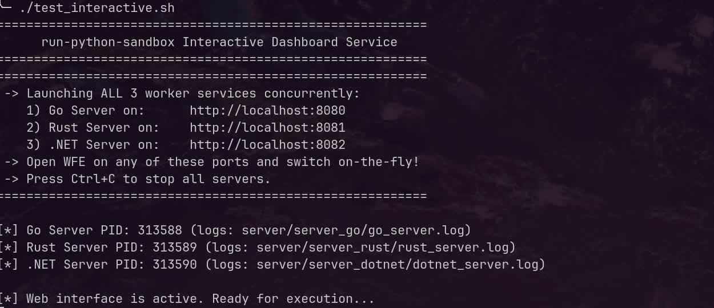
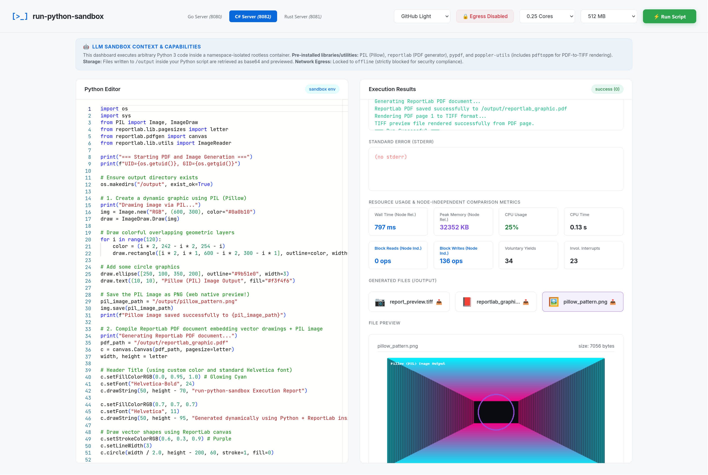

# run-python-sandbox

A secure, rootless Podman-in-Podman container designed to execute untrusted Python code and run "offensive" nested Podman containers safely. It implements the **Unix UID-in-container** security model to provide double-sandboxing, process-level isolation, and configurable resource allocation limits. Pre-installed tools inside the container include `reportlab` (PDF generation), `Pillow` (image editing), `pypdf`, and `poppler-utils` (`pdftoppm` CLI utility for high-fidelity PDF-to-TIFF page rendering).

This implementation is based on the security models and concepts explored in the article: [Unix solved this satisfactorily in 1971. We took two days to figure that out.](https://www.ikangai.com/unix-solved-this-satisfactorily-in-1971-we-took-two-days-to-figure-that-out/)




---

## Key Features
* **Rootless Host Run**: Fully unprivileged execution on the host machine.
* **Unix UID Isolation**: Executes untrusted code under dynamically provisioned low-privileged UIDs (`10000–65000`) inside the container.
* **Namespace Sandboxing**: Isolates Mount and PID namespaces per execution using `unshare`.
* **Safe Nested Podman**: Spawns nested rootless containers inside the sandbox using Podman's VFS storage driver.
* **Locked Egress Control**: Hardcoded network-disabled (`offline`) policies on API workers and UI for ultimate security compliance.
* **Input Directory Mounting**: Upload files in the UI or pass them in the API to mount them as a read-only volume inside the container at `/input/`.
* **Standard Core Windows/macOS Fonts**: Equips the container with Microsoft core fonts (Arial, Times, Courier, etc.), ChromeOS core/extra fonts (Arimo, Tinos, Cousine, Carlito, Caladea), and DejaVu/URW-base35 fonts for high-fidelity text rendering in PDFs and images.
* **Request GUID Tracing**: Assigns a unique trace GUID to every script run, standardizing temporary host directories to `/tmp/sandbox-out-[guid]` and `/tmp/sandbox-in-[guid]`.
* **Hardware-Independent Performance Metrics**: Captures scheduler context switches and filesystem I/O metrics for node-independent codebase comparisons.
* **Interactive Monaco Web UI**: Pastable Python editor with dynamic module autocomplete, file upload input zone, live output previews (images, text, PDF rendering via PDF.js, and TIFF rendering via LibTiff WebAssembly), and configurable CPU and RAM limit controls.

---

## Quick Start

### 1. Build the Container
Run the build script to compile the container image:
```bash
./build.sh
```

### 2. Run the Interactive Web Frontend
Launch the interactive web interface (defaults to the Go backend on port 8080):
```bash
./test_interactive.sh
```
Open your browser at [http://localhost:8080](http://localhost:8080) to paste scripts, trigger sandbox runs, customize resource limits, and preview generated files.

### 3. Run the Worker via CLI
You can execute Python files using the host-side worker script directly:
```bash
python3 worker.py --run_py path/to/script.py --network offline --output_dir ./my_outputs --cpus 1.0 --memory_mb 2048
```

---

## Mechanics: The UID-in-Container Model

### 1. Internal Rootless Podman
Inside the container, unprivileged users (`sandbox-user` at UID `10001`) use rootless Podman mapped to subuids.
Because we utilize the `vfs` storage driver, nested containers run entirely in user-space storage, eliminating the need to mount dangerous host devices like `/dev/fuse`.

### 2. Strict Egress Controls
Outbound internet access is blocked dynamically. For security compliance:
* The web servers (Go & Rust) hardcode `NETWORK_MODE=offline`.
* Any execution through the web API forces the sandbox to run network-disabled.
* The lower-level CLI runner (`worker.py`) remains configurable (with `offline` and `isolated` options) to facilitate local testing and image pull checks.

---

## API Contract: On-Demand HTTP Services (Go, Rust, & .NET)

All three services expose a `POST /run` endpoint:

**Request Payload:**
```json
{
  "code": "import os; print(os.listdir('/input'))",
  "network": "offline",
  "cpus": 1.0,
  "memory_mb": 4096,
  "input_files": {
    "data.txt": "SGVsbG8gd29ybGQ="
  }
}
```

* **`cpus`** (float): Limits the container's CPU allocation (e.g. `0.25`, `0.5`, `1.0`, `2.0`). Use `0.0` for unlimited.
* **`memory_mb`** (integer): Limits the container's RAM allocation in MB (e.g. `256`, `512`, `1024`, `4096`). Use `0` for unlimited.
* **`input_files`** (object): Dictionary mapping filenames to their Base64-encoded file contents. These files are mounted read-only to `/input/` inside the container.

**Response Payload:**
```json
{
  "stdout": "['data.txt']\n",
  "stderr": "",
  "exit_code": 0,
  "metrics": {
    "wall_time_ms": 280,
    "max_memory_kb": 20480,
    "cpu_percentage": "94%",
    "user_time_sec": 0.04,
    "sys_time_sec": 0.01,
    "fs_inputs": 0,
    "fs_outputs": 8,
    "voluntary_context_switches": 31,
    "involuntary_context_switches": 5
  },
  "output_files": {},
  "run_id": "97e68c07-b280-4dfa-b108-a53b519bfb8d"
}
```
*Note: Any output files written by the sandboxed python execution to `/output` are base64-encoded and returned in the `output_files` map. The `run_id` contains the unique request trace GUID.*

### Node-Independent Metrics
* **`fs_inputs` & `fs_outputs`**: The number of filesystem blocks read and written.
* **`voluntary_context_switches`**: Indicates how many times the code yielded execution control.
* These metrics remain constant for the same algorithm across different host machines, serving as hardware-independent indicators for program profile analysis.

---

## Running the Services

### Running the Go Service
Change into the Go server directory, build, and run:
```bash
cd server/server_go
go build -o server_go_bin main.go
PORT=8080 ./server_go_bin
```

### Running the Rust Service
Change into the Rust server directory, build, and run:
```bash
cd server/server_rust
cargo run --release
```
*Note: The Rust service utilizes fully asynchronous Axum and Tokio subprocess handling for low latency.*

### Running the .NET Service
Change into the .NET server directory, build, and run:
```bash
cd server/server_dotnet
dotnet run --configuration Release
```
*Note: The .NET service uses a high-performance Minimal API backend with asynchronous process spawning.*

---

## Test Suite
We provide a comprehensive testing framework in `test.sh` to verify security boundaries:
```bash
./test.sh
```

Tests validate user isolation, process visibility restrictions, nested container runs, egress policy matching, and resource performance capturing.
